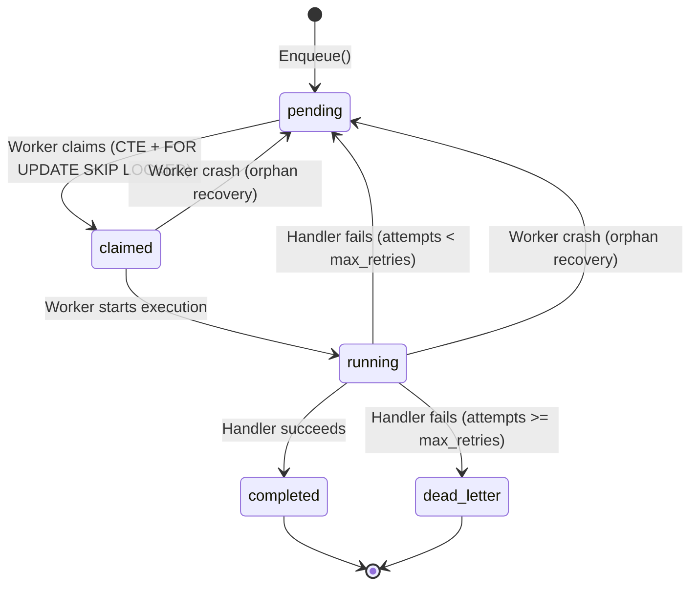
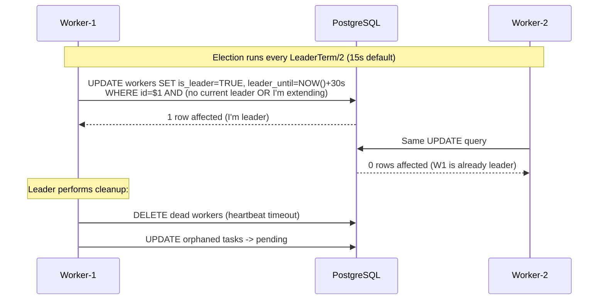
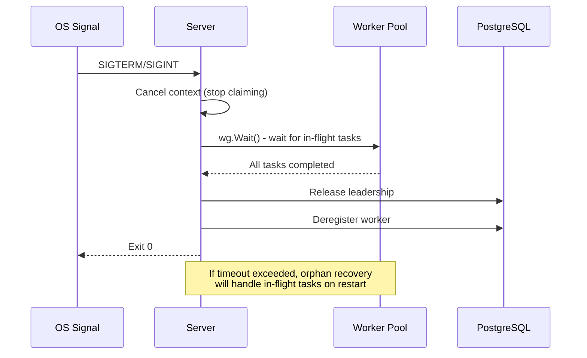

# Architecture Overview

The Task Orchestrator is a distributed background job processing system that uses **PostgreSQL as a durable priority queue**. It implements the "Database-as-a-Queue" pattern with at-least-once delivery semantics.

---

## Core Pattern: Database-as-a-Queue

| Property | Implementation |
|----------|----------------|
| **Storage** | PostgreSQL `tasks` table with JSONB payloads |
| **Claiming** | `FOR UPDATE SKIP LOCKED` for contention-free claiming |
| **Priority** | `ORDER BY priority DESC, created_at ASC` |
| **Delivery** | At-least-once (tasks recovered on crash/timeout) |
| **Idempotency** | `UNIQUE (type, idempotency_key)` constraint |

### Why PostgreSQL?

- **ACID guarantees**: Tasks are never lost, even during crashes
- **Existing infrastructure**: No additional message broker to operate
- **Transactional enqueue**: Task creation can be part of your application's transaction
- **SQL familiarity**: Query, aggregate, and manage tasks with standard SQL

### Trade-offs

- Higher latency than Redis/RabbitMQ (polling vs. push)
- Increased database load under high throughput
- Row-level locking limits horizontal scalability

---

## System Architecture

```
┌─────────────────────────────────────────────────────────────────────────────┐
│                              PostgreSQL                                     │
│  ┌─────────────────┐  ┌─────────────────┐                                   │
│  │   tasks table   │  │  workers table  │                                   │
│  │   (job queue)   │  │ (coordination)  │                                   │
│  └────────▲────────┘  └────────▲────────┘                                   │
└───────────┼────────────────────┼────────────────────────────────────────────┘
            │                    │
            │    ┌───────────────┘
            │    │
     ┌──────┴────┴──────┐     ┌─────────────────┐     ┌─────────────────┐
     │    Worker-1      │     │    Worker-2      │     │    Worker-N      │
     │  ┌────────────┐  │     │  ┌────────────┐  │     │  ┌────────────┐  │
     │  │  Server    │  │     │  │  Server    │  │     │  │  Server    │  │
     │  │  ┌──────┐  │  │     │  │  ┌──────┐  │  │     │  │  ┌──────┐  │  │
     │  │  │Pool  │  │  │     │  │  │Pool  │  │  │     │  │  │Pool  │  │  │
     │  │  │(10)  │  │  │     │  │  │(10)  │  │  │     │  │  │(10)  │  │  │
     │  │  └──────┘  │  │     │  │  └──────┘  │  │     │  │  └──────┘  │  │
     │  └────────────┘  │     │  └────────────┘  │     │  └────────────┘  │
     │   ★ LEADER       │     │                  │     │                  │
     └──────────────────┘     └──────────────────┘     └──────────────────┘
```

---

## Task Lifecycle



### Status Transitions

| From | To | Trigger |
|------|-----|---------|
| — | `pending` | `Enqueue()` called |
| `pending` | `claimed` | Worker claims via `claimTasks()` |
| `claimed` | `running` | Handler execution begins |
| `running` | `completed` | Handler returns `nil` |
| `running` | `pending` | Handler returns error (retry scheduled) |
| `running` | `dead_letter` | Handler fails after `max_retries` |
| `claimed`/`running` | `pending` | Orphan recovery by leader |

---

## The Claim Query

The heart of the system is the atomic claim query using PostgreSQL's `FOR UPDATE SKIP LOCKED`:

```sql
WITH claimable AS (
    SELECT id 
    FROM tasks
    WHERE status = 'pending' 
      AND (next_retry_at IS NULL OR next_retry_at <= NOW())
    ORDER BY priority DESC, created_at ASC
    LIMIT $1
    FOR UPDATE SKIP LOCKED
)
UPDATE tasks
SET status = 'claimed',
    claimed_at = NOW(),
    worker_id = $2,
    updated_at = NOW()
FROM claimable
WHERE tasks.id = claimable.id
RETURNING tasks.*
```

**Key Properties:**

- **`SKIP LOCKED`**: Never blocks on rows locked by other workers
- **CTE + UPDATE**: Atomic select-and-update in single statement
- **Priority ordering**: Higher priority tasks claimed first
- **Partial index**: `idx_tasks_claimable` optimizes the WHERE clause

---

## Leader Election

In distributed mode, one worker is elected **leader** to perform maintenance duties:



### Leader Duties

| Duty | Interval | Description |
|------|----------|-------------|
| **Dead worker cleanup** | `CleanupInterval` (1m) | Remove workers with stale heartbeat |
| **Orphan task recovery** | `CleanupInterval` (1m) | Reset tasks assigned to dead workers |
| **Worker count metric** | `CleanupInterval` (1m) | Update `workers_total` gauge |

### Split-Brain Considerations

> [!WARNING]
> The leader election uses a simple timestamp-based lease without fencing tokens. If the leader is network-partitioned but still running, it may continue cleanup duties for up to `LeaderTerm` (30s) after losing the lock. This is acceptable for idempotent cleanup operations but could cause duplicate task recovery in edge cases.

---

## Concurrency Model

### Worker Pool

Each worker maintains a bounded goroutine pool using a buffered channel as semaphore:

```go
// Semaphore limits concurrent tasks to WorkerPoolSize
s.semaphore = make(chan struct{}, s.config.WorkerPoolSize)

// In claim loop:
for _, task := range tasks {
    s.semaphore <- struct{}{} // Block if pool is full
    s.wg.Add(1)
    go func(t *tasks.Task) {
        defer func() {
            <-s.semaphore // Release slot
            s.wg.Done()
        }()
        s.executeTask(ctx, t)
    }(task)
}
```

### Graceful Shutdown



---

## Code Audit Findings

### ✅ Safe Patterns

| Pattern | Location | Status |
|---------|----------|--------|
| Semaphore ordering | `claimAndExecuteTasks` | Correct: acquire before `wg.Add(1)` |
| Channel panic prevention | `Shutdown()` | Safe: semaphore never closed |
| Claim deadlocks | `claimTasks` | Safe: `SKIP LOCKED` prevents waits |
| Transaction isolation | All queries | Appropriate: READ COMMITTED default |
| Context propagation | All DB calls | Correct: `*Context` variants used |
| Deferred row cleanup | `claimTasks`, `GetActiveWorkers` | Correct: `defer rows.Close()` |

### ⚠️ Minor Issues

| Issue | Location | Impact | Recommendation |
|-------|----------|--------|----------------|
| `rows.Close()` leak | `updateQueueMetrics` | Memory leak on scan errors | Move `rows.Close()` to defer |
| Orphan recovery blocking | `recoverOrphanedTasks` | Brief blocking possible | Add `SKIP LOCKED` or accept |
| Thundering herd polling | Main claim loop | Wasted DB queries | Add jitter to `ClaimInterval` |
| No fencing token | Leader election | ~30s split-brain window | Document or implement fencing |

### Recommended Improvements

1. **Event-driven claiming**: Use PostgreSQL `LISTEN/NOTIFY` to wake workers when tasks are enqueued
2. **Adaptive polling**: Backoff when queue empty, speed up when tasks available
3. **Fencing tokens**: Add monotonic version to leader election for stronger consistency
4. **Claim batching**: Tune `WorkerPoolSize` vs claim batch size for optimal throughput
